# 精霊神世紀　フェイエリア

_Seireishin Seiki Fhey Area_

Mega-Drive CD, Wolfteam, 1992

Fhey Area é um JRPG que saiu apenas no Japão para o Mega-Drive CD.

## História

Fhey Area era legal, mas aí algo aconteceu.

## Interface

Tela inicial do jogo, após apertar start:
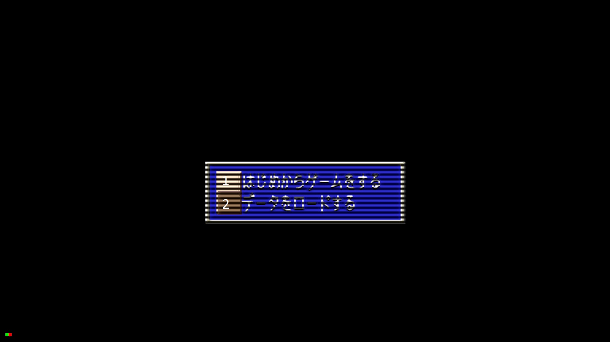

1. Começar novo jogo
2. Carregar jogo

Se escolher 1, o novo jogo vai começar imediatamente. Caso escolha 2 (carregar), a seguinte tela vai aparecer:
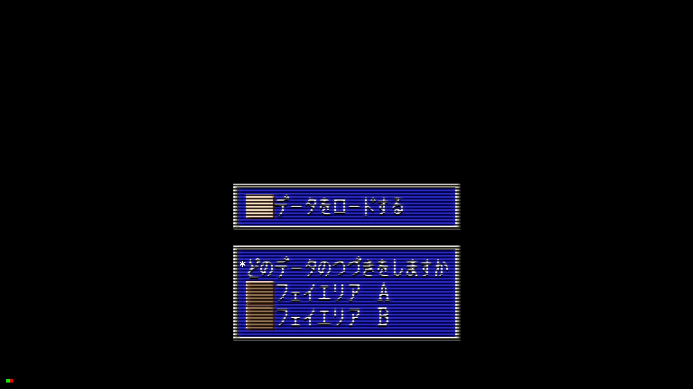

Existem dois slots para salvar o jogo: A e B. Esta tela mostra a opção de qual slot carregar.

O jogo pode ser salvo no INN (em inglês mesmo):
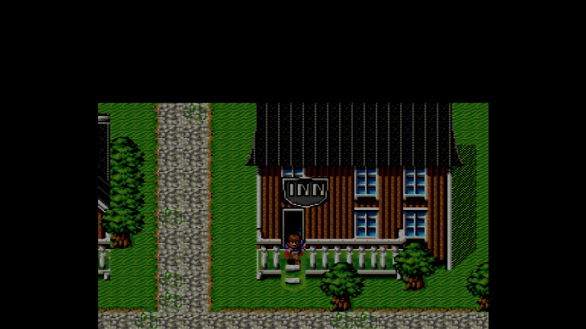

Ao entrar no INN e falar com a atendente, é preciso pagar para salvar (custa 2G):
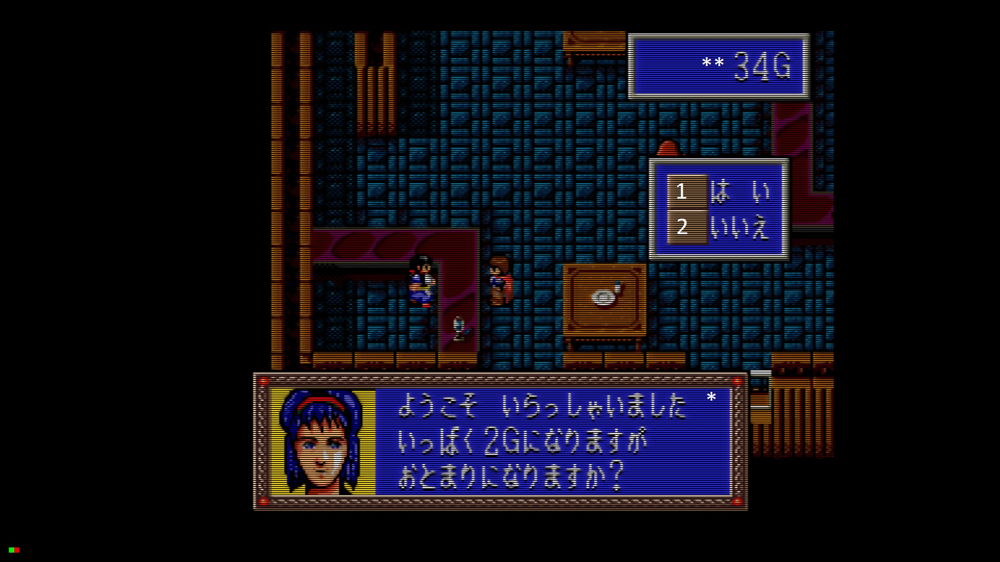

1. Sim (salvar)
2. Não (cancelar)

** Dinheiro disponível

Esta é a loja de itens:
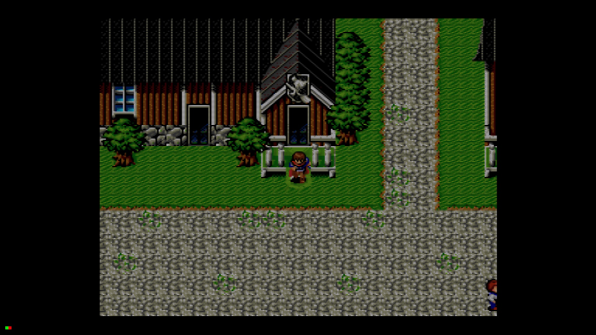

Dentro da loja, pode-se comprar ou vender itens.
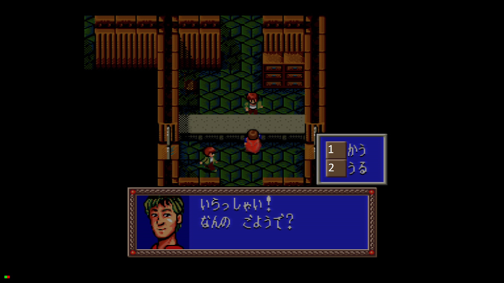

1. Comprar
2. Vender

Ao escolher comprar, esses são os itens disponíveis na primeira cidade:
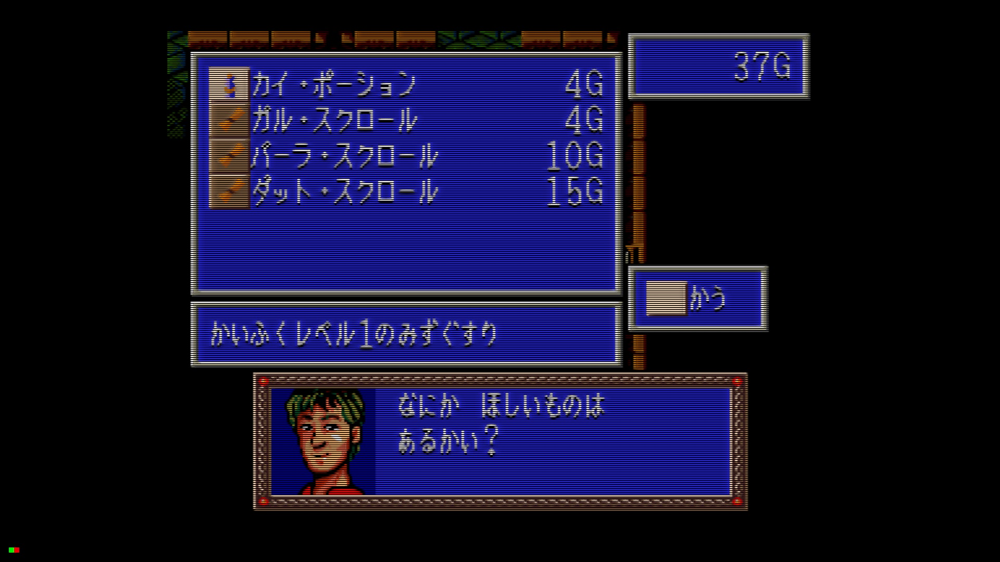

Se escolher vender, mostra os itens no inventário para vender:

### Menus do jogo

O nome do personagem principal (o único no início do jogo) é **レイフェル** (Reifer ou Leyfer ou algo similar, a leitura direta do katakana é RE-I-FE-RU). Esse nome vai aparecer em vários lugares dos menus onde é preciso selecionar o personagem.

### Menu principal (botão A)
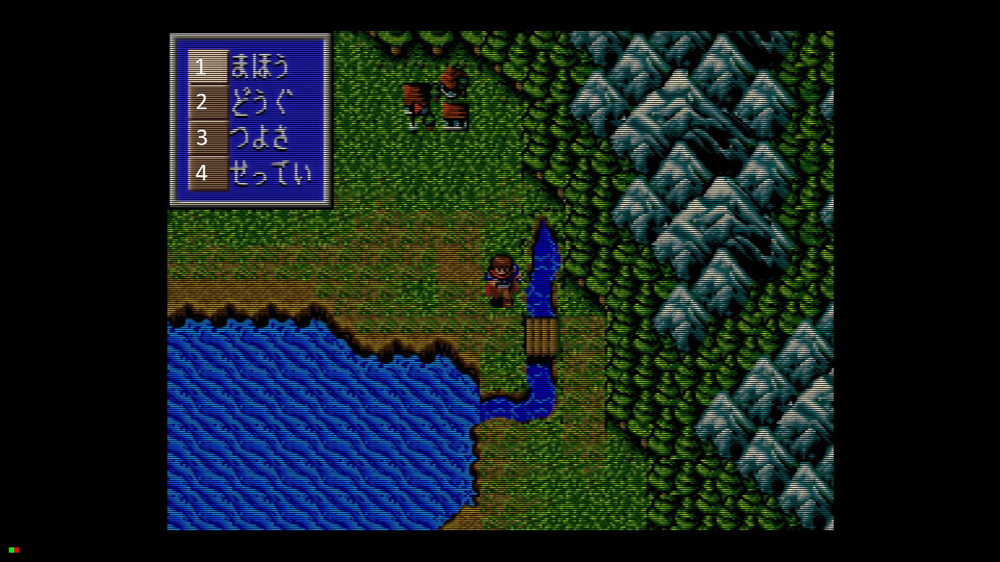

1. Magia
2. Inventário
3. Status
4. Configurações (do game)

### Menu de magia
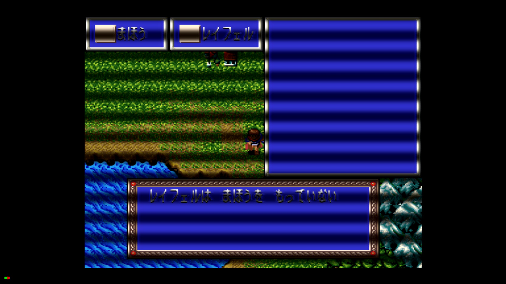

O personagem não tem nenhuma magia inicialmente, então não aparece nada.

### Inventário
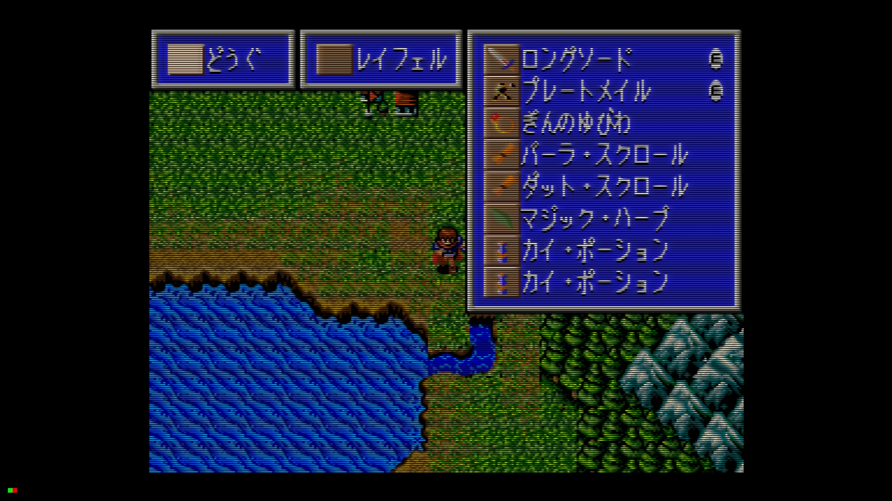

### Status

Selecionando o menu Status (つよさ) aparecem duas opções:
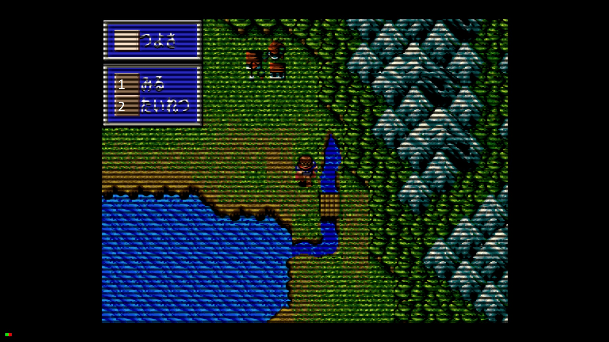

1. Ver status
2. Formação/ordem do grupo (たいれつ)

Visualizando status:
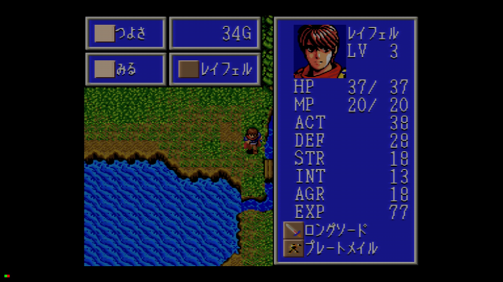

Formação/ordem do grupo:
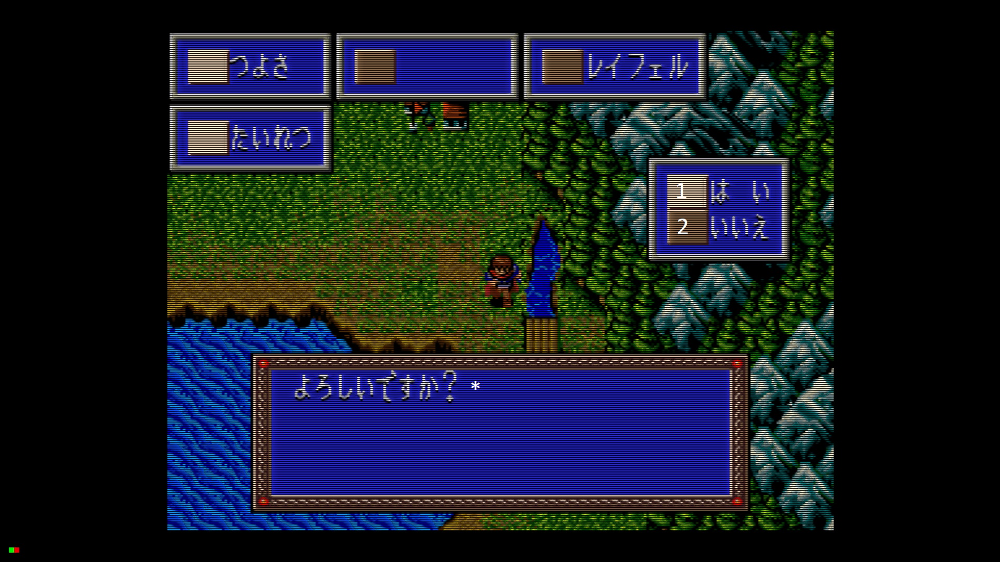

Deve servir para trocar quem está na frente no grupo, mas só faz sentido com mais de um personagem. Ao selecionar a ordem, a interface pergunta "esta ordem está ok?" com opções 1. Sim / 2. Não.

### Configurações

As três opções de configuração são:
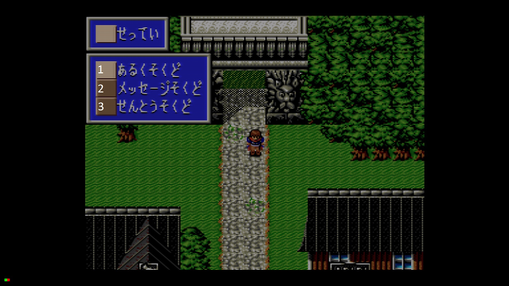

1. Velocidade de movimentação
2. Velocidade do texto
3. Velocidade dos combates

A velocidade de movimentação tem dois níveis:
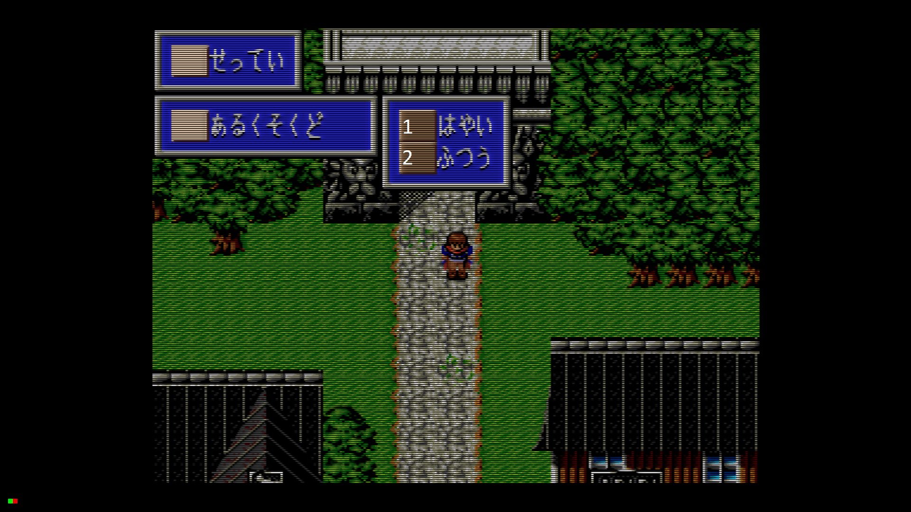

1. Rápido
2. Normal (*default*)

Como a velocidade normal é o default, para andar mais rápido é preciso mudar essa configuração.

Para a velocidade do texto existem cinco níveis:
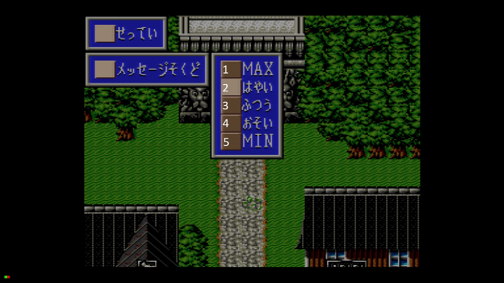

1. Máxima
2. Rápida
3. Normal (*default*)
4. Lenta
5. Mínima

A velocidade do combate tem dois níveis:

1. Rápida
2. Normal (*default*)

## Combate

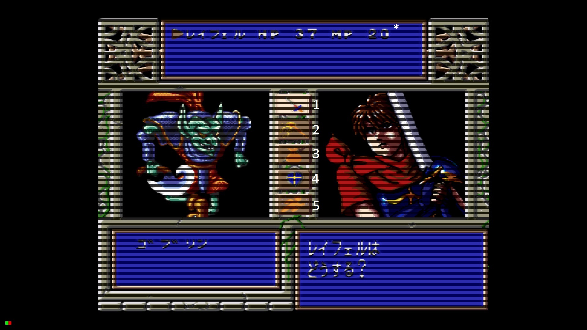

1. Ataques com a arma equipada
2. Magia
3. Itens do inventário
4. Escudo (aumenta a defesa mas não pode atacar no mesmo turno)
5. Fugir
* Status de HP e MP do personagem

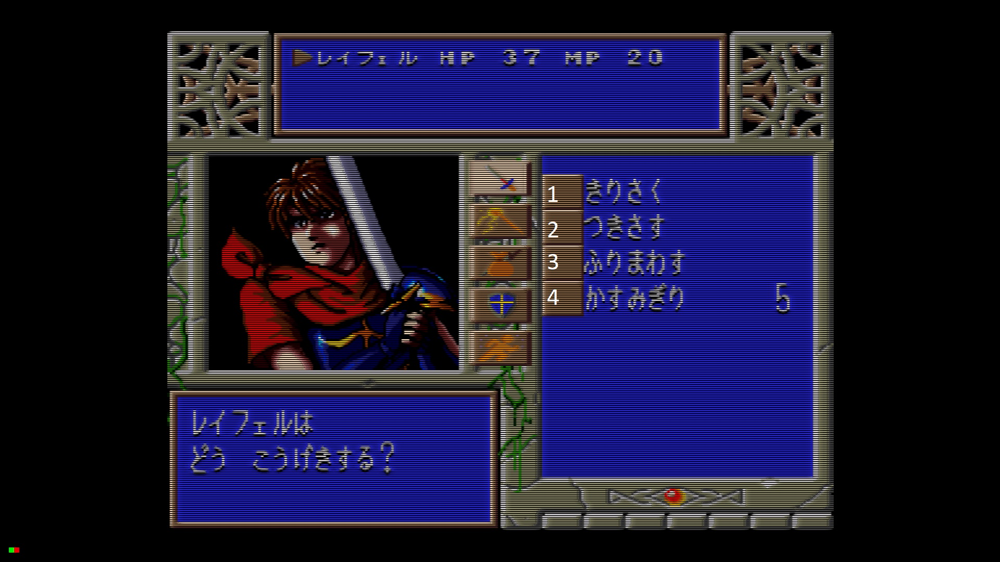

Após selecionar Ataque (primeira opção) vai ser necessário escolher o tipo de ataque.
Os tipos de ataque disponíveis vão variar dependendo do personagem, e o personagem
principal (**レイフェル**) é o que tem mais tipos de ataque. Em todo caso, os tipos
podem variar a força do ataque, a probabilidade de acertar, e se gasta MP.

No manual são explicados em detalhe apenas os ataques de **レイフェル**, e alguns
desses ataques também estão disponíveis em outros personagens. 

1. Tipo mais comum
2. Um pouco mais forte
3. Ataque forte
4. Ataque forte mas gasta MP

## Manual

https://segaretro.org/images/a/a0/Seirei_Shinseiki_Fhey_Area_MCD_JP_Manual.pdf (thanks, [Sega Retro](http://segaretro.org) ).

A [página do jogo no Sega Retro](https://segaretro.org/Seirei_Shinseiki_Fhey_Area) tem scans de
materiais promocionais e da capa do jogo.
